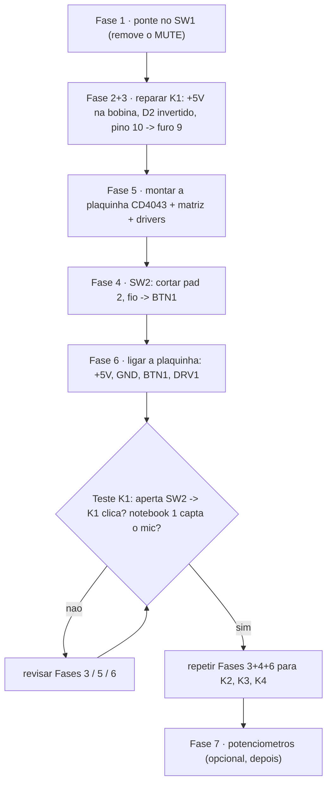
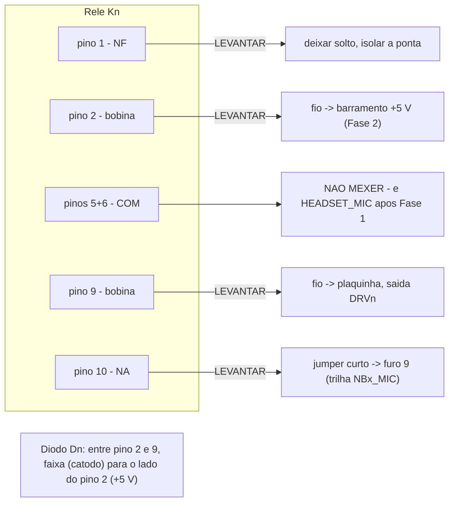
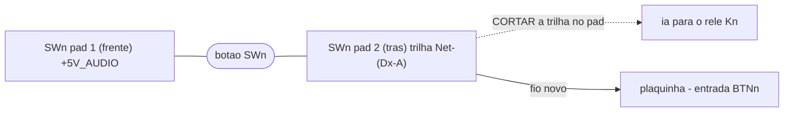
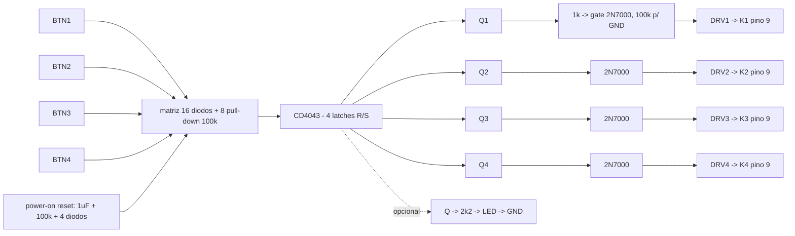
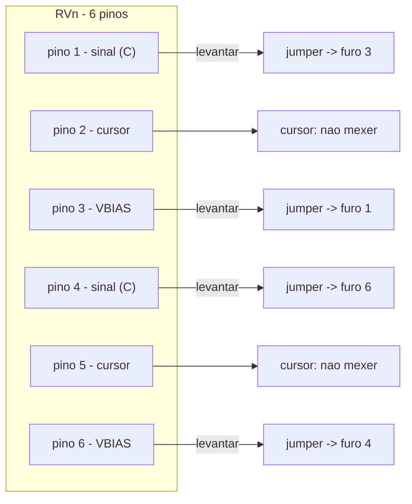
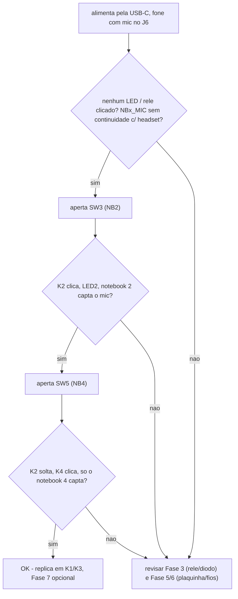

# REWORK-003 — Diagrama do reparo da placa fabricada

Versão: 1.0 · Data: 2026-08-28
Versão visual (artefato HTML): publicada separadamente.
Detalhe em texto: `REWORK-001` (rework à mão) e `SCH-010` (lógica CD4043).

**Placa física = commit `b86a034`.** Coordenadas em mm, sistema do `.kicad_pcb`.
Faça **o canal K1 do começo ao fim**, teste o notebook 1, e só então replique.

Legenda dos diagramas:
- **levantar** = dessoldar e puxar o pino ~1,5 mm para fora do furo
- **fio novo** = jumper de fio fino (AWG 30) que você adiciona
- **cortar** = trilha cortada com estilete no pad
- **deixar** = não mexer; conferir com multímetro

---

## 00 · Ordem de trabalho

**Ferramentas:** ferro ponta fina + solda 0,5 mm + fluxo · sugador/malha ·
fio AWG 30 · estilete · multímetro (continuidade + DC) · cola quente · lupa.

---

## 01 · Tirar o MUTE — ponte no SW1

Solde um fio curto (ou pingo de solda) unindo os 2 furos **com trilha** do SW1.
O corpo do SW1 pode ficar no lugar.

**Confere:** continuidade *sleeve do J6* ↔ *pino 5 de qualquer relé*.

---

## 02 · Barramento +5 V para as bobinas

Passe um fio de **+5 V** (de `SW2 pad 1` ≈ (96,8 ; 214,5), que é `+5V_AUDIO`,
ou de `TP1`) até a região dos relés. Ele será soldado no **pino 2** levantado
de K1–K4 na Fase 3.

---

## 03 · Reparar cada relé K1–K4 + diodo D2–D5

Pinos do G5V-1: `1 = NF` · `2 e 9 = bobina` · `5 e 6 = COM` · `10 = NA`.
Dn: D2→K1, D3→K2, D4→K3, D5→K4.

1. Levantar pinos **1, 2, 9, 10**. Deixar 5 e 6 soldados + cola quente.
2. pino 2 → fio ao **+5 V** · pino 9 → fio à **plaquinha DRVn** ·
   pino 10 → **jumper para o furo 9** · pino 1 → isolado.
3. Diodo Dn em paralelo com a bobina (pinos 2–9), **faixa para o pino 2**.

**Confere:** pino 2 ↔ +5V · pino 9 ↔ fio da plaquinha ·
pino 10 ↔ sleeve do TRRS daquele notebook · pino 1 ↔ nada.

---

## 04 · Botões — reusar SW2–SW5

| Botão | pad 2 ≈ (x ; y) | Fio novo → | Comanda |
|---|---|---|---|
| SW2 | (95,56 ; 212,0) | `BTN1` | NB1 · K1 |
| SW3 | (108,3 ; 212,0) | `BTN2` | NB2 · K2 |
| SW4 | (122,5 ; 212,0) | `BTN3` | NB3 · K3 |
| SW5 | (134,6 ; 212,0) | `BTN4` | NB4 · K4 |

**Confere:** `SWn pad 2` ↔ relé: **não** apita mais; apertando SWn, pad 2 ↔ pad 1 apita.

---

## 05 · Montar a plaquinha (perfboard)

**Matriz** (botão X → S do canal X + R dos outros 3):

| Aperta | SET | RESET |
|---|---|---|
| BTN1 | S1 | R2 · R3 · R4 |
| BTN2 | S2 | R1 · R3 · R4 |
| BTN3 | S3 | R1 · R2 · R4 |
| BTN4 | S4 | R1 · R2 · R3 |
| power-on | — | R1 · R2 · R3 · R4 |

**CD4043BE (DIP-16):** VDD=16(+5V) · VSS=8(GND) · ENABLE=5(+5V) · NC=13 ·
A: S1/R1/Q1 = 4/3/2 · B: S2/R2/Q2 = 6/7/9 · C: S3/R3/Q3 = 12/11/10 ·
D: S4/R4/Q4 = 14/15/1.

Passos: 100 nF no CI · 8×100k pull-down (S1–4, R1–4) · 16×1N4148 matriz ·
power-on (1µF+100k+4×1N4148 → R1–4) · 4× (Q→1k→gate 2N7000, gate→100k→GND,
dreno=DRVn, fonte=GND) · 100µF bulk · LEDs opcionais.

---

## 06 · Ligar a plaquinha à placa — 12 fios

| plaquinha | ponto na placa principal |
|---|---|
| +5V | `SW2 pad 1` (ou TP1) — mesmo fio da Fase 2 |
| GND | qualquer terra (blindagem do J1, furo de fixação) |
| BTN1..BTN4 | `SW2..SW5 pad 2` (trilha cortada) |
| DRV1..DRV4 | `K1..K4 pino 9` (levantado) |

---

## 07 · Potenciômetros (opcional, depois)

RV1…RV5: levantar pinos 1, 3, 4, 6 e cruzar **1↔3** e **4↔6**. Sem cortar trilha.

---

## 08 · Teste

---

## 09 · Compras

Só a plaquinha precisa de peça nova — ver `SCH-010 §4.1` para a tabela com
links LCSC (CD4043BE **C39537**, 2N7000 **C9114**, 1N4148 **C402212**,
100k **C1364475**, 1k **C120055**, 1µF **C2167638**, + genéricos de kit).
**Não** compra: relés, D2–D5, potenciômetros, botões (reusa SW2–SW5).
